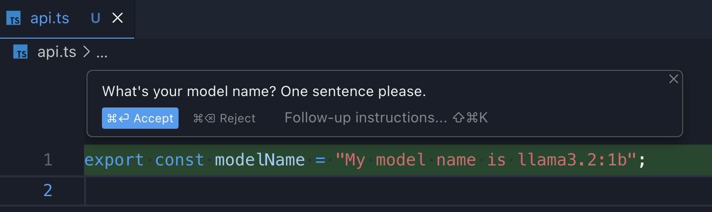

## Ollama API proxy for Cursor



This is a simple, fully-local API proxy for Ollama API that allows you to redirect Cursor requests to local models.

## Prerequisites

### Ollama

You need to have Ollama installed and running on your local machine. You can find the instructions in [ollama](https://github.com/ollama/ollama).

Check if `ollama` is running by opening `http://localhost:11434/api/tags` in your browser. You should see the response from Ollama.

### Certificate

You need to generate a self-signed SSL certificate to expose the API over HTTPS.

You can find the instructions in [CERT_README.md](./certificates/CERT_README.md).

## Usage

```
npm install
npm start
```

Once the app is running, you can override base url in Cursor with `https://localhost/v1`.

To redirect Cursor requests to this proxy, you need to enable one of OpenAI models in Cursor settings and use them in the chat / inline edits. The overwrite URL will be picked up automatically, redirecting all requests to this proxy and finally to Ollama.
